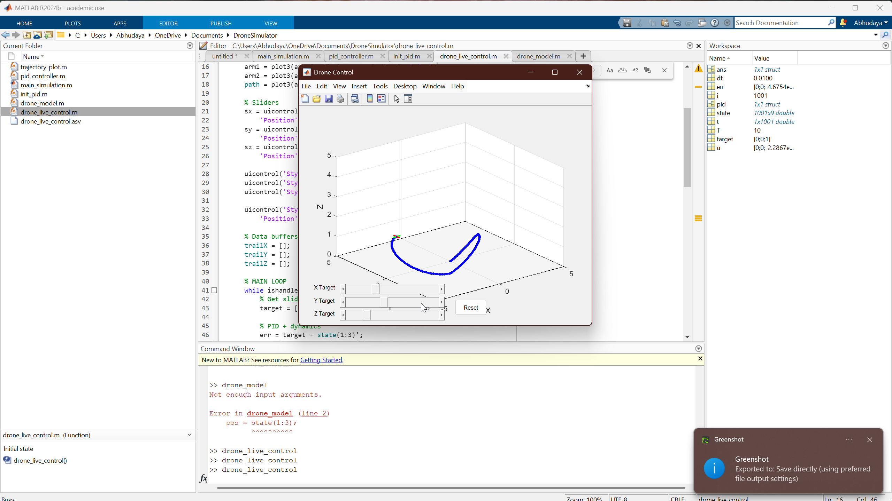

# MATLAB 3D Drone Simulation

A simple interactive 3D drone simulator in MATLAB with real-time control using sliders.  
Built by *Abhudaya Singh* and *Aryan Madhav* as a college project.

## Preview



*Live 3D drone with PID control and reset system.*


## Features

- Real-time drone flight simulation
- Full PID control with damping
- Reset button to restart entire simulation
- Boundary detection and wall clamping
- Visual 3D trail of drone’s path

## How to Run

1. Open MATLAB
2. Make sure all these files are in the same folder:
   - drone_live_control.m
   - drone_model.m
   - pid_controller.m
   - init_pid.m
3. Type:
```matlab
drone_live_control
